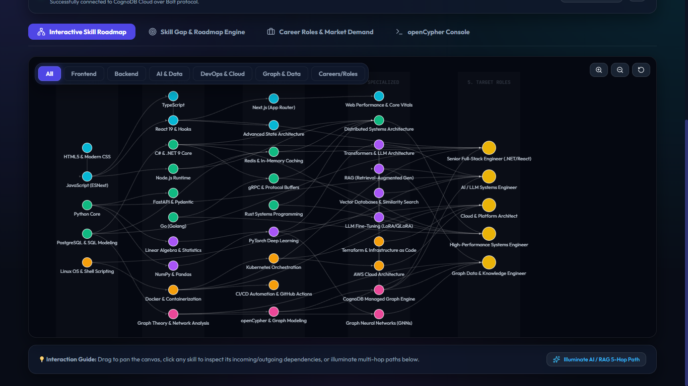
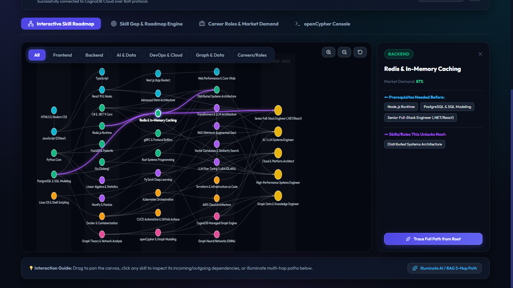
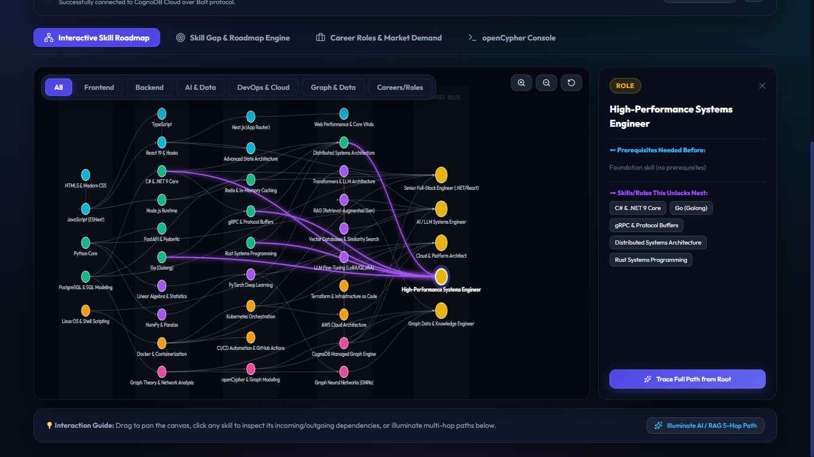
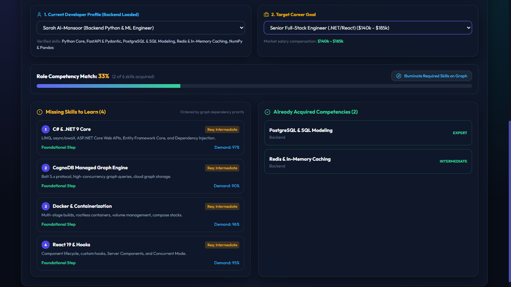
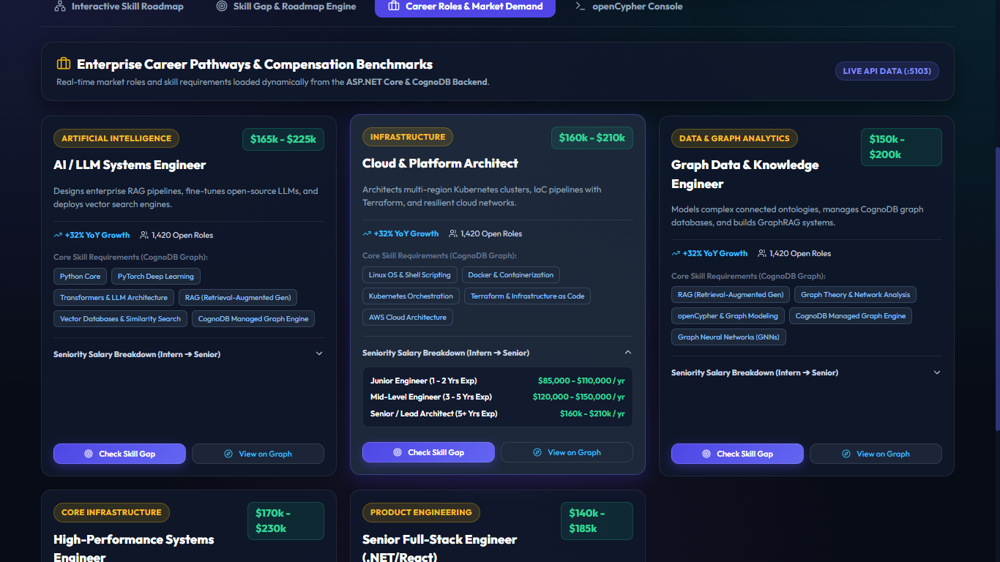
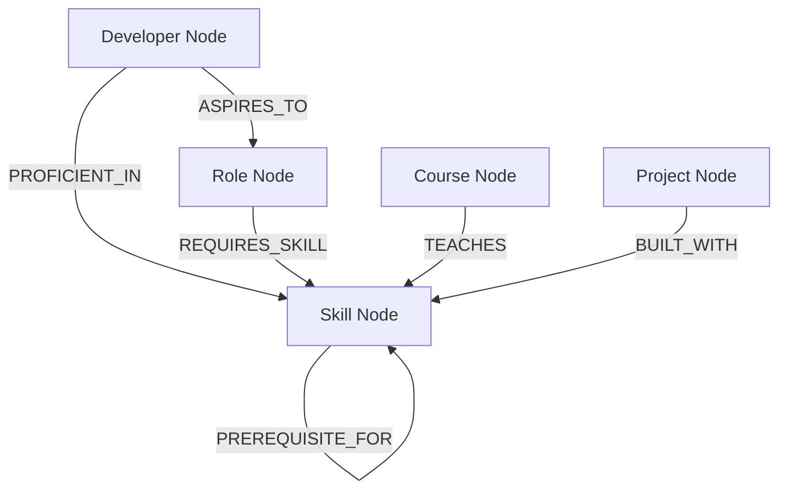

# SkillGraph: Tech Career & Skill Dependency Knowledge Graph

> Built with **ASP.NET Core (.NET 9 / C#)**, **React 19 / TypeScript (Vite)**, and **CognoDB Cloud** (openCypher / Bolt 5.x).

SkillGraph is an enterprise-grade graph intelligence application that models software engineering career pathways, multi-hop transitive skill dependencies, developer candidate profiles, and learning roadmaps on top of **CognoDB Cloud**.

---

## 📸 Application Screenshots & Visual Showcase

### 1. Interactive Skill Dependency Knowledge Graph
Visualize multi-layer technology stacks from foundational programming paradigms to advanced architectures, tracing transitive dependency paths across 5+ hops in real-time.



---

### 2. Node Dependency Inspection & Path Highlighting
Select any skill node to instantly analyze incoming prerequisite dependencies, outgoing unlocked technologies, and demand metrics directly retrieved from CognoDB.



---

### 3. Career Role Pathway & Prerequisite Graph Tracing
Target any engineering role (e.g. *High-Performance Systems Engineer*, *AI/LLM Systems Engineer*) to automatically illuminate required foundational skill pathways across the graph.



---

### 4. Graph-Powered Skill Gap & Readiness Engine
Compare developer candidate profiles against target career milestones. The graph engine evaluates acquired vs. missing competencies, calculating graph-distance readiness bonuses and prioritized learning steps.



---

### 5. Enterprise Career Roles & Market Demand Catalog
Live compensation benchmarks, growth trajectories, and dynamic skill requirements synced with the ASP.NET Core & CognoDB graph backend.



---

## 🌟 Why a Graph Database?

Relational SQL databases model data as flat rows with rigid foreign key constraints. In a technology knowledge ecosystem, **the relationships are primary citizens**:

1. **Multi-Hop Dependency Traversal (Recursive Paths)**:
   - *In SQL*: Finding transitive prerequisite chains (e.g. `Python -> Linear Algebra -> PyTorch -> Transformers -> RAG Architecture`) requires complex, performance-heavy Recursive Common Table Expressions (`WITH RECURSIVE`) or multiple self-joins.
   - *In CognoDB (openCypher)*: Graph traversals of arbitrary depth are written in a single clean pattern:
     ```cypher
     MATCH path = (prereq:Skill)-[:PREREQUISITE_FOR*1..5]->(target:Skill {id: $targetSkillId})
     RETURN path
     ```
2. **Heterogeneous Multi-Entity Connectivity**:
   - Entities connect naturally across domains (`Developer` &rarr; `Skill` &rarr; `Role` &rarr; `Course` &rarr; `Project`) without requiring dozens of bloated junction/join tables.
3. **Graph-Native Degree Centrality & Skill Gap Intelligence**:
   - Calculating which single skill unlocks the most career roles for a candidate is a natural graph degree centrality query rather than complex multi-table aggregations.

---

## 📐 Graph Data Model



### Nodes & Properties
- **`Skill`**: `id`, `name`, `category` (Frontend, Backend, AI & Data, DevOps, Graph), `difficulty`, `marketDemand` (1-100), `description`, `iconName`
- **`Role`**: `id`, `title`, `domain`, `seniorityLevel`, `avgSalary`, `description`
- **`Developer`**: `id`, `name`, `title`, `experienceYears`, `avatar`, `bio`
- **`Course`**: `id`, `title`, `platform`, `url`, `durationHours`, `rating`
- **`Project`**: `id`, `name`, `difficulty`, `description`

### Relationships
- `(:Skill)-[:PREREQUISITE_FOR {importance: 'mandatory' | 'recommended'}]->(:Skill)`
- `(:Role)-[:REQUIRES_SKILL {minLevel: 'beginner' | 'intermediate' | 'expert', weight: 1..5}]->(:Skill)`
- `(:Developer)-[:PROFICIENT_IN {level: 'beginner' | 'intermediate' | 'expert', yearsOfExp: int}]->(:Skill)`
- `(:Developer)-[:ASPIRES_TO]->(:Role)`
- `(:Course)-[:TEACHES {depth: 'comprehensive'}]->(:Skill)`
- `(:Project)-[:BUILT_WITH]->(:Skill)`

---

## 🏛️ System Architecture

```text
CognoDB/
├── SkillGraph.Api/               # ASP.NET Core Web API (C#)
│   ├── Controllers/              # REST Endpoints (Graph, PathFinder, SkillGap, Health, Seed)
│   ├── Services/                 # CognoDBService & ICognoDBService (Neo4j.Driver DI)
│   ├── Models/                   # C# Records & DTOs
│   ├── Data/                     # DatabaseSeeder in C#
│   ├── wwwroot/                  # Production-compiled React 19 SPA
│   ├── appsettings.json          # CognoDB Cloud connection configuration
│   └── Program.cs                # DI Container, Swagger, CORS, Static Files
├── frontend/                     # React 19 + TypeScript + Vite + Lucide SPA
│   ├── src/
│   │   ├── components/           # GraphCanvas, SkillGapAnalyzer, RoleCatalog, QueryInspector
│   │   ├── App.tsx
│   │   └── index.css
│   └── vite.config.ts            # Proxy to ASP.NET Core API (:5103)
├── PROJECT_EXPLANATION_GUIDE.md  # Detailed interview prep guide for .NET & Cypher
└── README.md
```

---

## 🔍 Key Cypher Queries Explained

### 1. Multi-Hop Prerequisite Path Traversal (2 to 5 Hops)
```cypher
MATCH path = (prereq:Skill)-[:PREREQUISITE_FOR*1..5]->(target:Skill {id: $targetSkillId})
RETURN 
  [n IN nodes(path) | { id: n.id, name: n.name, category: n.category }] AS pathNodes,
  length(path) AS hops
ORDER BY hops DESC
```

### 2. Skill Gap & Graph Prerequisite Readiness Analyzer
```cypher
MATCH (d:Developer {id: $devId})
MATCH (r:Role {id: $roleId})
MATCH (r)-[req:REQUIRES_SKILL]->(needed:Skill)
OPTIONAL MATCH (d)-[prof:PROFICIENT_IN]->(needed)
OPTIONAL MATCH (c:Course)-[:TEACHES]->(needed)
OPTIONAL MATCH (p:Project)-[:BUILT_WITH]->(needed)
OPTIONAL MATCH (d)-[:PROFICIENT_IN]->(owned:Skill)-[:PREREQUISITE_FOR*1..3]->(needed)
RETURN 
  needed.id AS skillId,
  needed.name AS skillName,
  req.minLevel AS requiredLevel,
  prof IS NOT NULL AS isAcquired,
  count(DISTINCT owned) AS readinessBonus,
  collect(DISTINCT c)[0..2] AS courses
ORDER BY isAcquired ASC, req.weight DESC, readinessBonus DESC
```

### 3. Highest ROI Next Skill (Career Pivot Intelligence)
```cypher
MATCH (d:Developer {id: $devId})
MATCH (potential:Skill)
WHERE NOT (d)-[:PROFICIENT_IN]->(potential)
MATCH (r:Role)-[:REQUIRES_SKILL]->(potential)
RETURN 
  potential.id AS skillId,
  potential.name AS skillName,
  count(DISTINCT r) AS unlockedRolesCount,
  collect(DISTINCT r.title) AS unlockedRoles
ORDER BY unlockedRolesCount DESC, potential.marketDemand DESC
LIMIT 5
```

---

## 🚀 Setup & Run Instructions

### 1. Provision CognoDB Cloud Instance
1. Go to [https://console.cognodb.com/signup](https://console.cognodb.com/signup) and create a free account (no credit card required).
2. Create a free **c0** instance and choose your preferred cloud region.
3. Save your connection URI (`bolt+s://<instance-id>.databases.cognodb.cloud`), username (`cognodb`), and generated password.
4. Configure connection credentials in `SkillGraph.Api/appsettings.json` or via environment variables:
   ```bash
   COGNODB_URI="bolt+s://<instance-id>.databases.cognodb.cloud"
   COGNODB_USER="cognodb"
   COGNODB_PASSWORD="<your-password>"
   ```

### 2. Run the .NET Web API Backend
```bash
cd SkillGraph.Api
dotnet run
```
Backend API & Swagger will be live at `http://localhost:5103` (and Swagger at `http://localhost:5103/swagger`). The backend will automatically seed initial graph nodes & relationships upon startup if empty, or you can trigger `/api/seed` via the UI / Swagger.

### 3. Run the React Development Frontend
```bash
cd frontend
npm install
npm run dev
```
Open [http://localhost:3000](http://localhost:3000) in your browser.
